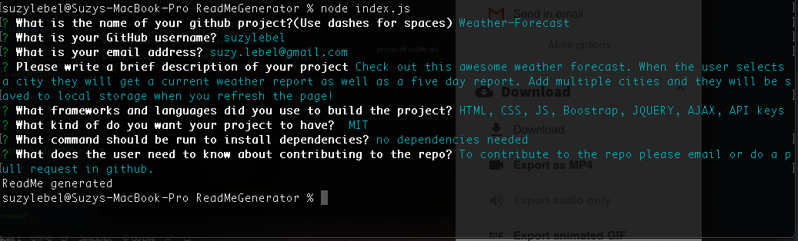

# 09 Node.js Homework: Professional README Generator

WATCH THE SCREEN CASTIFY VIDEO [HERE](https://drive.google.com/file/d/1Zj3rK1KWRZ53rGEcxl0cbGMTNpQhcrIf/view)

[Readme Generator](https://github.com/suzylebel/ReadMeGenerator)

## User Story

```
AS A developer
I WANT a README generator
SO THAT I can quickly create a professional README for a new project
```


## Getting Started

Using Node.js and the npm package Inquirer I was able to code a readme generator based on users response in the command line of the terminal. 

There is a video screen capture that highlights the terminal side of this project. Screen shots are also included in this readme file. In my video walk though I do 2 examples of going through the terminal command line questions and include screenshots for both! Watch the video [HERE](https://drive.google.com/file/d/1Zj3rK1KWRZ53rGEcxl0cbGMTNpQhcrIf/view)


## About This project 

I created my code in an index.js file and a generatemarkdown.js file. I also needed to install requirer and util-  npm dependencies

When the user answers the command line questions in the terminal a readme file is generated and their answers are appended to the approproiate locations!

## Roadmap

Javascript, and node.js were the main frame works of this project. 

Learning to use badges was a learning curve for this homework but I created an if and else if statement to change the license badge based on what a user selected. 

``` if (answer.license === "MIT") {
    badgelicense = "[](https://opensource.org/licenses/MIT)"
  } else if (answer.license === "Apache") {
    badgelicense = "[](https://opensource.org/licenses/Apache-2.0)"
  } else if (answer.license === "none") {
    badgelicense = "N/A"
  } else if (answer.license === "GNU GPL v3") {
    badgelicense = "[](http://www.gnu.org/licenses/gpl-3.0)"
  } else if (answer.license === "Eclipse Public License 1.0") {
    badgelicense = '[](https://opensource.org/licenses/EPL-1.0)'
  }
 
```

Here are the prompted questions with repsonses in terminal: 


I also played around with the prompt questions using input, checkboxes and lists for users to select from. 

## Questions/Contribute 
1. Fork the project
2. Create your own branch 
3. Commit your changes 
4. Push to your branch 
5. Open a pull request for sandbox


## Contact

Suzy Le Bel 
suzy.lebel@gmail.com
[Readme Generator](https://github.com/suzylebel/ReadMeGenerator)